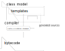

# Example of a Spring cloud-backed user interface

Most cloud application rely on a service oriented architecture that provides business logic via services having a 
network interface. 
The deployment of multiple instances of microservices with loadbalancing has several advantages;

* improves system availability
* allow updates without downtime (blue/green deployment)
* reduces failure rate
* scales when system load gets higher (services are added)


While planning a software architecture this leads to additional requirements that need to be taken into account 
during development of the system. Additional interface definitions and service contracts are required and update 
paths need to be specified.


To run the example start both, the rest service and the user interface, then navigate to `http://localhost:8080`.

## Microservice based Spring implementation example

This project shows a possible implementation using OpenFeign and Spring REST Controllers. 
This is an advanced Java web server project using the Maven build tool with a 
Vaadin userinterface that provides editing functionality to a driver's log. The structure 
of most of the objects follows a pattern; They need to be edited in the UI, then transferred 
via a REST client interface via hypertext protocol to the service instance. 


The microservice module `RestServiceEndpoint` handles all the requests such as create/read/update/delete and paged listing and
creates database queries to serve the requests. All of this happens on the same data model but on
different machines, decoupled by a load-balancer and a service discovery.

The application was developed using a compiler plugin 
<a href="https://uc-mobileapps.com/seife-annotation-processor/">seife annotation processor</a> that is able to
generate code from the datamodel for the user interface and REST service endpoints. 
Seife is not required to compile and run the example since the code is already there. If the code is adjusted or 
extended, the plugin needs to be executed to update the autogenerated program parts.
The project is completely configured to show how to utilize seife to process custom templates.

### Module 'DataModel'

This module defines the entities, both the `UserInterface` and the `RestServiceEndpoint` projects depend on it.
The project also provides value objects containing the attributes for searching and filtering the result set
(`TripFilterVO`). The user enters filter criteria in the GUI which are passed on to the REST service via the VO's,
no additional code needs to be written as they are automatically maintained from the entity data model.

Its data model is also published to SeifeModels/DataModel.classmodel.json.

### Module 'UserInterface'

Contains the UI code including a list of entries and a form for editing. Most of the code to show 
the components is created from the information already available in the data model.

Start from command line via `mvn spring-boot:run`

The project shows how to use paging with a REST service interface and uses a generated REST client requests
(see `com.uc_mobileapps.examples.restclient.TripClient` for example). Its code is automatically deduced from 
TripController defined in the `RestServiceEndpoint` project.

Whenever a new service method is added the client implementation is updated via the seife annotation processor 
during compilation. Whenever the data model is extended the annotation processing allows to 

The application listens on socket `localhost:8080` for regular HTTP web browser requests and serves the user interface.
It simulates a service discovery that resolves all configured clients to 'localhost:8081' (see below).

#### Folder `src/main/seife/templates`

Contains the project template for all feign clients. The imported `SeifeModels/RestService.classmodel.json` data 
is used to create source code for all REST client services such as TripClient. If a structural change is required
the template can be adjusted so every client implementation reflects the change. 

#### Folder `src/main/seife/bindings`

This contains custom templates for particular datatypes.

* **boolean**
 
  Template to adds a read-only CheckBox for Vaadin Grid Columns having a boolean datatype.
  It suffices to add the @SeifeBinding annotation on a grid column that has a boolean data type.
  The following code is created from the template
  ```
  Grid.Column<Entity> column = addComponentColumn(entity -> {
        Checkbox cb = new Checkbox(entity.isBooleanAttribute());
        cb.setEnabled(false);
        return cb;
    });
  ```

* **java.time.LocalDateTime**

  The template uses a localized DateTimeFormatter for grid columns with the current locale.


* **Customer** / **Address**

  Shows how to resolve the fields of a particular entity with a TemplateRenderer. 
  
Once defined, these templates may be used consistently in all places. 
See the autogenerated code in `com.uc_mobileapps.examples.cloud.ui.forms.TripGrid` for an example.
Compared to typical reflection based libraries there is no additional layer of indirection which
makes the code more efficient and comprehensible stack-traces.
The code generator capabilities can also be used for rapid prototyping then later maintain the code manually.

### Module 'RestServiceEndpoint'

This application listens on `localhost:8081`, it is the Spring cloud implementation of a REST controller 
and provides access to the database layer with paging and filtering via `com.uc_mobileapps.examples.rest.TripController`. 
No service registration is configured in this example, for further information see the documentation 
[spring cloud consul](https://cloud.spring.io/spring-cloud-consul/reference/html/).

To start it from the command line use
`mvn spring-boot:run`

Its model is published to `SeifeModels/RestService.classmodel.json` and used when creating the clients for the service 
endpoint.

## Annotation processing during compilation

The class model and the templates are used to generate additional
sources that are part of the resulting byte-code in the class files.



The [Seife Annotation Processor](https://uc-mobileapps.com/seife-annotation-processor/) has an intelligent type-based template resolution mechanism that 
makes it a flexible development tool for everyday use. 